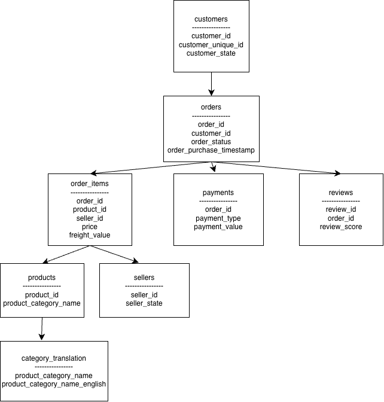

# Marketplace Order & Customer Analytics with SQL

## Project Overview

This project analyzes the Olist Brazilian E-commerce dataset using MySQL.

The analysis focuses on marketplace sales performance, product categories, customer purchase behavior, cohort retention, seller concentration, delivery performance, and customer reviews.

The goal of this project is to demonstrate practical SQL skills for business and data analysis, including multi-table joins, CTEs, window functions, CASE WHEN, aggregation, and cohort analysis.

---

## Tech Stack

- MySQL
- DBeaver
- SQL
- GitHub

---

## Database Schema

The analysis is based on 8 core tables:

- `customers`
- `orders`
- `order_items`
- `payments`
- `reviews`
- `products`
- `sellers`
- `category_translation`



---

## Business Questions

This project explores the following questions:

1. How do orders and GMV change over time?
2. Which product categories generate the most revenue?
3. What percentage of customers make repeat purchases?
4. How does customer retention change after the first purchase?
5. How concentrated is marketplace revenue among sellers?
6. What is the average delivery time?
7. How often are orders delivered late?
8. Is late delivery associated with lower customer review scores?

---

## Key Findings

### 1. Customer Repeat Purchase Rate

- Total customers: **93,358**
- Repeat customers: **2,801**
- Repeat customer rate: **3.00%**

Only a small proportion of identified customers completed more than one delivered order during the observed period, indicating relatively limited repeat purchasing.

---

### 2. Top Revenue Product Category

The highest-revenue product category was:

**Health & Beauty**

Revenue:

**1,233,131.72**

Other major categories included:

- Watches & Gifts
- Bed, Bath & Table
- Sports & Leisure
- Computers & Accessories

---

### 3. Seller Revenue Concentration

The top seller generated:

**226,987.93**

This represented only:

**1.72%**

of total delivered-order merchandise revenue.

This suggests that marketplace revenue was relatively distributed across sellers rather than being dominated by a single seller.

---

### 4. Delivery Performance

Average delivery time:

**12.50 days**

Late delivery rate:

**8.11%**

Among **96,470** delivered orders with valid delivery dates, **7,826** arrived after the estimated delivery date.

---

### 5. Delivery Performance and Customer Reviews

Average review score for on-time or early deliveries:

**4.29**

Average review score for late deliveries:

**2.57**

Late deliveries were associated with substantially lower customer review scores.

The difference between the two groups was:

**1.72 points**

This analysis identifies an association between delivery performance and review scores rather than proving causation.

---

## SQL Techniques Used

This project demonstrates practical use of:

- `SELECT`
- `WHERE`
- `GROUP BY`
- `HAVING`
- `ORDER BY`
- `COUNT()`
- `SUM()`
- `AVG()`
- `MIN()`
- `MAX()`
- `COUNT(DISTINCT ...)`
- `INNER JOIN`
- `LEFT JOIN`
- `CASE WHEN`
- Common Table Expressions (`CTE`)
- `DATE_FORMAT()`
- `DATEDIFF()`
- `PERIOD_DIFF()`
- Window Functions
- `LAG()`
- `DENSE_RANK()`
- `PARTITION BY`
- Cohort Retention Analysis

---

## Analysis Workflow

### Sales Analysis

The sales analysis evaluates:

- Total order volume
- Order status distribution
- Dataset time range
- Monthly orders
- Monthly GMV
- Average Order Value
- Monthly active customers
- Month-over-month GMV growth

GMV in this project is calculated using merchandise value:

`SUM(order_items.price)`

Freight charges are excluded from this GMV definition.

---

### Product Analysis

The product analysis focuses on:

- Product category revenue
- Number of orders by category
- Category-level Average Order Value
- Top revenue categories
- Monthly Top 3 product categories

Window functions such as `DENSE_RANK()` and `PARTITION BY` are used to rank product categories within each month.

---

### Customer Analysis

Customer identity is based on:

`customer_unique_id`

rather than `customer_id`, because the same customer may have different `customer_id` values across different orders.

The customer analysis evaluates:

- Number of orders per customer
- Repeat customer count
- Repeat customer rate
- Purchase frequency distribution

The observed repeat customer rate was approximately **3.00%**.

---

### Cohort Retention Analysis

Customers are grouped into cohorts based on their first completed purchase month.

The analysis then measures whether customers return in subsequent months.

SQL techniques used include:

- `MIN()`
- CTEs
- `DATE_FORMAT()`
- `PERIOD_DIFF()`
- `COUNT(DISTINCT ...)`

This allows monthly retention behavior to be analyzed from the customer's first purchase onward.

---

### Seller Analysis

Seller performance is analyzed using:

- Seller revenue
- Number of orders
- Number of customers
- Revenue per order
- Seller revenue share

The highest-revenue seller contributed only **1.72%** of total merchandise revenue from delivered orders, suggesting relatively low concentration at the individual seller level.

---

### Delivery Analysis

Operational performance is evaluated using actual and estimated delivery dates.

Metrics include:

- Average delivery time
- Late order count
- Late delivery rate
- Delivery performance by customer state

The average delivery time was **12.50 days**, while the late delivery rate was **8.11%**.

---

### Review Analysis

Customer review scores are connected with delivery performance using the `orders` and `reviews` tables.

Orders are classified as:

- On Time or Early
- Late

Average review scores were:

- **4.29** for on-time or early deliveries
- **2.57** for late deliveries

The result shows a strong association between delayed delivery and lower customer satisfaction.

---

## Project Structure

```text
sql-marketplace-customer-analytics/
│
├── README.md
│
├── sql/
│   ├── 01_database_setup.sql
│   ├── 02_sales_analysis.sql
│   ├── 03_product_analysis.sql
│   ├── 04_customer_analysis.sql
│   ├── 05_cohort_retention.sql
│   └── 06_operations_reviews.sql
│
└── images/
    └── er_diagram.png
```

---

## SQL Files

### `01_database_setup.sql`

Contains database initialization and setup commands.

---

### `02_sales_analysis.sql`

Includes:

- Total orders
- Order status distribution
- Dataset time range
- Monthly orders
- Monthly GMV
- Average Order Value
- Monthly active customers
- Month-over-month GMV growth

---

### `03_product_analysis.sql`

Includes:

- Top product categories by revenue
- Product category revenue
- Category AOV
- Monthly Top 3 product categories
- Product category rankings

---

### `04_customer_analysis.sql`

Includes:

- Customer purchase frequency
- Repeat customers
- Repeat customer rate
- Purchase frequency distribution
- Customer frequency share

---

### `05_cohort_retention.sql`

Includes:

- Customer first purchase date
- Cohort month
- Order month
- Cohort month number
- Active customers by cohort
- Monthly cohort retention rate

---

### `06_operations_reviews.sql`

Includes:

- Top sellers by revenue
- Seller revenue share
- Average delivery time
- Late delivery rate
- Delivery performance by state
- Review score distribution
- Average review score
- Review score by delivery status
- Review score by delivery delay group

---

## Key Business Insights

The project highlights several important marketplace characteristics.

**Customer retention is limited.** Only about **3.00%** of identified customers completed more than one delivered order during the observed period.

**Revenue is relatively diversified across sellers.** The largest seller accounted for only **1.72%** of delivered-order merchandise revenue.

**Delivery performance is strongly associated with customer satisfaction.** On-time or early deliveries received an average review score of **4.29**, compared with only **2.57** for late deliveries.

These results demonstrate how SQL can be used to combine transactional, customer, product, seller, logistics, and review data to answer practical business questions.

---

## Skills Demonstrated

Through this project, I practiced and demonstrated:

- Relational database analysis
- Multi-table SQL joins
- Business KPI calculation
- Customer behavior analysis
- Product performance analysis
- Seller performance analysis
- Cohort retention analysis
- Operational performance analysis
- Window functions
- CTEs
- Conditional logic with `CASE WHEN`
- Date-based analysis
- Translating business questions into SQL queries
